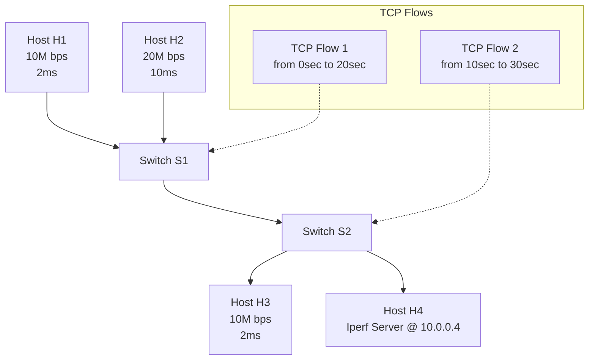
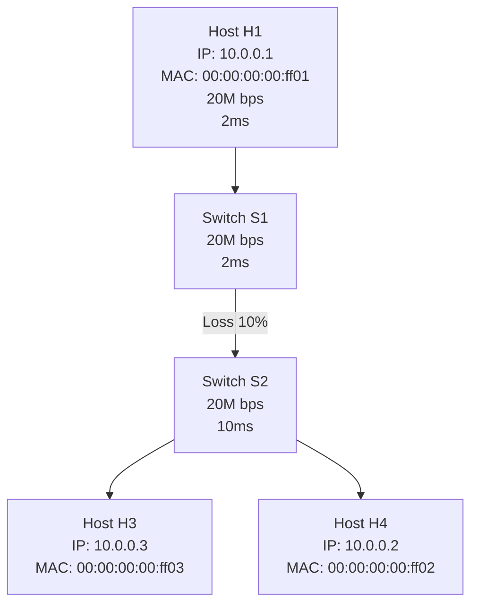

### 四、实验任务

#### 任务1：定制化拓扑

定制化拓扑

要求：

（1）定制化上述拓扑，并将脚本文件命名为customized_topo.py，提交文件中需包含该python文件

（2）利用iperf验证端到端带宽，并截图，下面提供了各主机间端到端带宽的参考范围：

- H1 – H2: 10Mbps with ~12ms latency 
- H2 – H4: <<16Mbps with ~22ms latency
- H3 – H4: 10Mbps with ~12ms latency

（3）通过sudo mn --custom ./customized_topo.py --topo mytopo --test pingall --link tc指令检验，并截图。描述一下出现的现象，并阐述一下原因。

#### 任务2：在虚拟终端上执行任务

在虚拟终端上执行任务

利用iperf生成TCP流 

- TCP Flow 1: 由h1按最大速率发向h3，持续时间为T=0sec~20sec
- TCP Flow 2: 由h2按最大速率发向h4，持续时间为T=10sec~30sec

要求：

（1） 利用python实现上述功能，并将脚本文件命名为host_iperf.py ，提交文件需包含该python文件。

（2）提交 Flow 1 和 Flow 2 带宽测试截图或文本文件，要求每0.5s测量一次。

（3）请描述一下出现的现象，并尝试解释一下原因。

（4）尝试修改 Switch S1 和 Switch S2 之间链路的丢包率，重复任务二，观察并描述在不同丢包率下出现的现象，尝试利用所学的知识解释一下原因。

